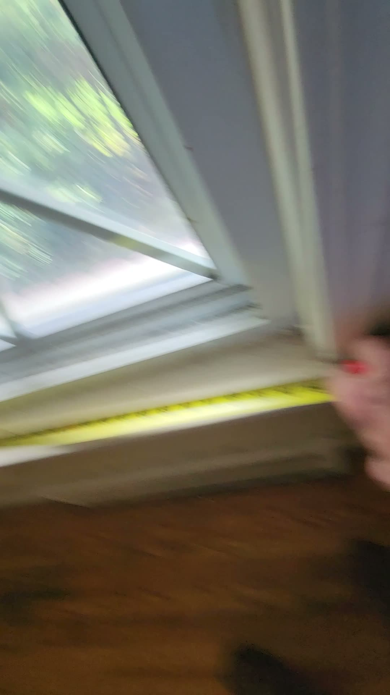
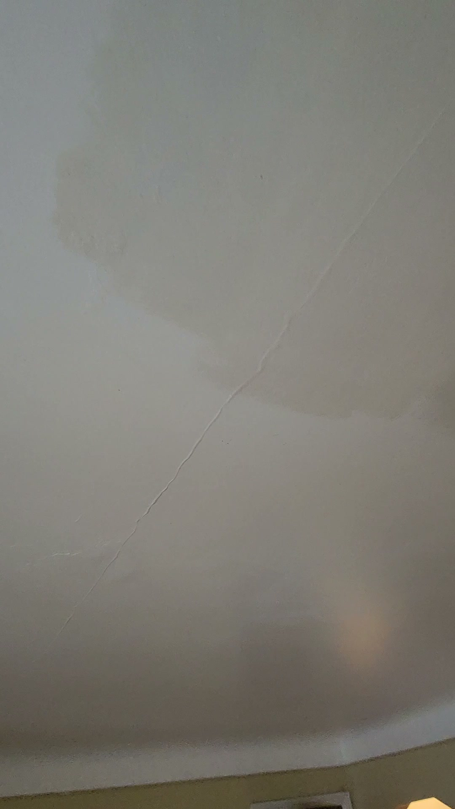
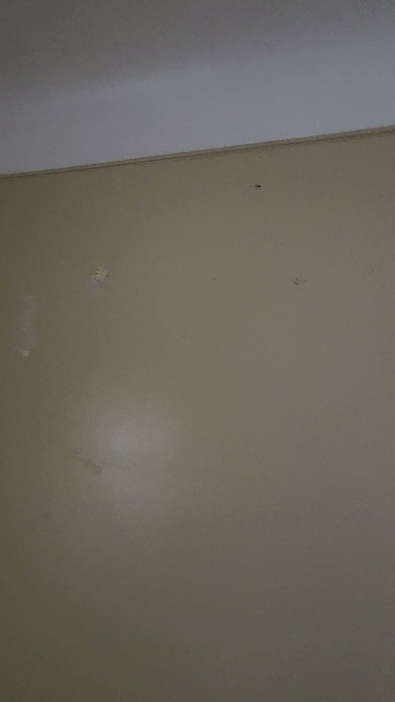
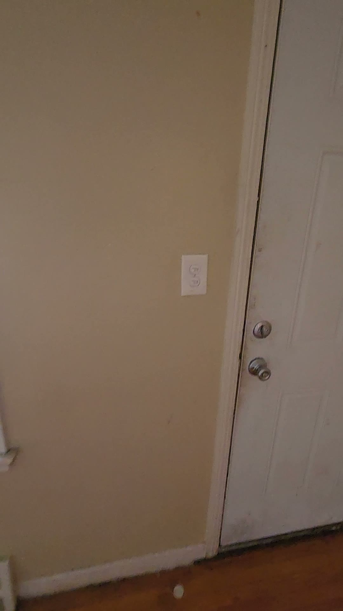
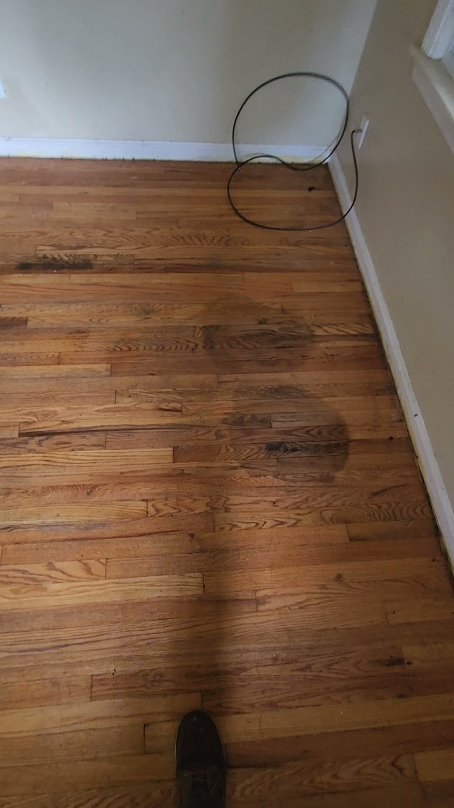
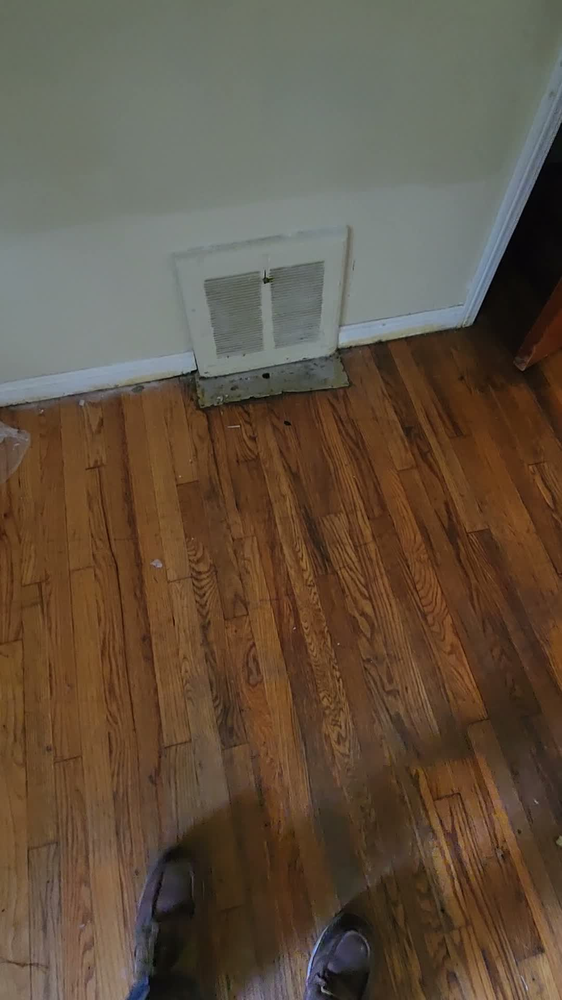
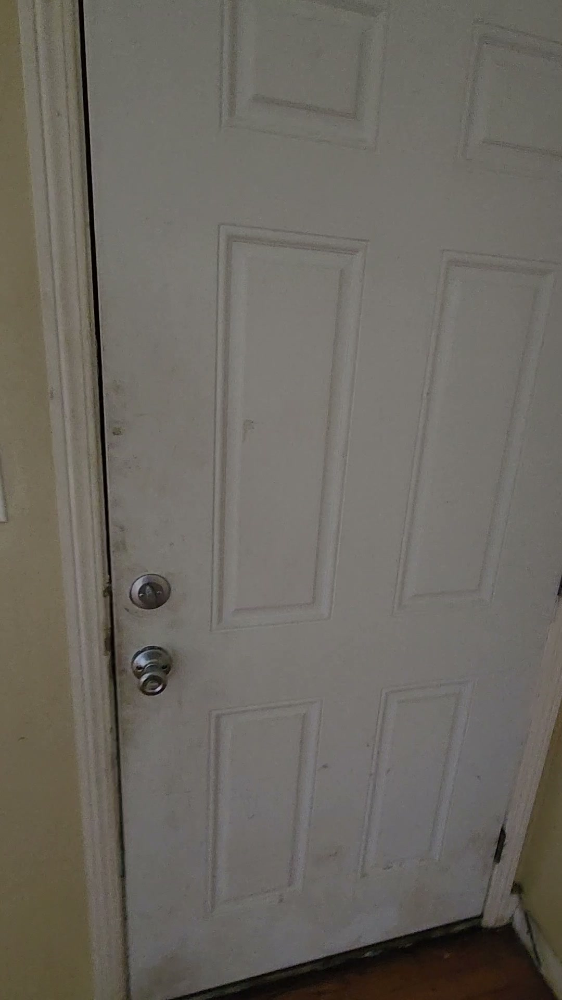
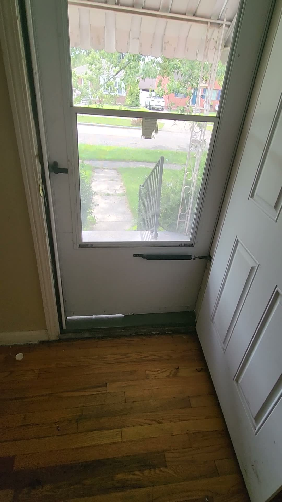

# GPM Property Management
### Move-Out Inspection Report — PropInspecAI Prototype (Living Room)

| | |
|---|---|
| **Property** | 1554 Brest, Lincoln Park, MI |
| **Job** | 121939 |
| **Date** | 2026-09-08 |
| **Inspector** | Chuck Larson |
| **Generated by** | PropInspecAI (prototype) — automated extraction from inspection video, pending human review |

---

## Outside Vendor Work Required

*(pulled to the top so a reviewer can hand this straight to scheduling — see full item detail in Living Room section below)*

| Vendor Trade | Work Required | Priority |
|---|---|---|
| Painting/Drywall | Repair wall mounting holes/patches and repaint; repair ceiling crack and repaint | Before next occupancy |
| Flooring | Clean/refinish stained hardwood; repair aluminum patch at wall vent, caulk base molding | Before next occupancy |

---

## Living Room

**Overall Condition: Fair** — Empty and generally serviceable, but requires wall, ceiling, flooring, window, and door work before next occupancy.

**Room Dimensions:** 14 ft × 11½ ft *(source: narrated by inspector, confirmed via tape measure visible in video)*

| Item | Condition | Assigned To | Recommended Action | Trade Category | Priority | Tenant Damage |
|---|---|---|---|---|---|---|
| Walls | Damaged | **Outside Vendor** | Repair holes/patches, then paint | Painting/Drywall | Before next occupancy | ☐ |
| Ceiling | Damaged | **Outside Vendor** | Repair crack, paint ceiling | Painting/Drywall | Before next occupancy | ☐ |
| Front picture-window blind | Damaged/Missing | **GPM Staff** | Install new blind; remove old mounting hardware; repair affected area | Doors/Windows (hardware) | Before next occupancy | ☐ |
| Side-window mini-blind | Damaged | **GPM Staff** | Replace mini-blind; remove old hardware; repair mounting area | Doors/Windows (hardware) | Before next occupancy | ☐ |
| Windows / glass | Good | — | None | — | No action | — |
| Hardwood flooring | Damaged | **Outside Vendor** | Clean / refinish affected area (method to be confirmed on-site) | Flooring | Before next occupancy | ☐ |
| Flooring at wall vent | Damaged | **Outside Vendor** | Repair patch, caulk base molding | Flooring | Before next occupancy | ☐ |
| Electrical outlets / cover plates | Fair | **GPM Staff** | Secure outlets; clean devices and cover plates | Electrical (minor — no rewiring) | Routine turnover | ☐ |
| Closet door | Damaged | **GPM Staff** | Adjust strike / door alignment | Carpentry | Routine turnover | ☐ |

*Assigned To applies GPM's current vendor-assignment SOP (`rules/vendor-assignment-sop.md`): painting and flooring repair/replacement are always outside-vendor scope regardless of severity; minor electrical (no rewiring/breaker box) and hardware adjustments default to GPM staff. Tenant Damage is left unchecked for reviewer sign-off — not pre-judged by the AI pass.*

**Turn summary: 3 items to Outside Vendor (walls/paint, ceiling/paint, flooring), 4 items to GPM Staff (blinds x2, outlets, closet door), 1 item no action needed.**

### GPM Staff — Materials & Labor (replacement/install items only)

*Pricing pending GPM's price book — cost lines below are placeholders for the reviewer to fill in.*

| Item | Work | Materials | Labor |
|---|---|---|---|
| Front picture-window blind | Install new blind | ___________ | ___________ |
| Side-window mini-blind | Replace mini-blind | ___________ | ___________ |

*Only GPM-staff items that are a replacement or install get a cost line — adjustments, cleaning, and securing (e.g. closet door latch, outlet cleaning) don't.*

---

## Photo Documentation

Stills below are frames pulled directly from the inspection video — no photos were taken separately, matching PropInspecAI's core idea of extracting everything from one video pass. Frame timing is approximate (sampled automatically), not the inspector's exact narration moment.

**Room dimensions — tape measure reading**
{width=20%}

**Ceiling — crack**
{width=20%}

**Walls — condition**
{width=20%}

**Window blind — damaged**
{width=20%}

**Hardwood flooring — staining**
{width=20%}

**Electrical outlet**
{width=20%}

**Front entry door**
{width=20%}

**Storm door**
{width=20%}

---

### Inspector Narration — Timestamped Reference

- **0:01–0:40** — Wall condition and mounting holes noted
- **0:20–0:43** — Ceiling crack identified
- **0:43–0:56** — Electrical outlet condition noted
- **1:05–1:14** — Front picture-window blind condition
- **Clip 2, 0:02–0:20** — Front picture-window opening measured: 75 inches
- **Clip 2, 0:20–0:29** — Side-window mini-blind / opening measured: 27 inches
- **Clip 2, 0:30–0:44** — Hardwood floor staining noted
- **Clip 2, 0:40–0:47** — Flooring repair needed at vent
- **Clip 2, 0:45–0:50** — Closet door latch issue noted

---

### About This Report

This report was generated automatically from raw inspection video (no manual data entry) using a PropInspecAI prototype pass. It was cross-checked against the official Zinspector report for this same property and matched nearly item-for-item, including an exact room-dimension match (14' × 11.5"). This is a **prototype output for internal review** — not yet connected to GPM's quoting process, and pending a human review step before any report goes to an owner or tenant.
